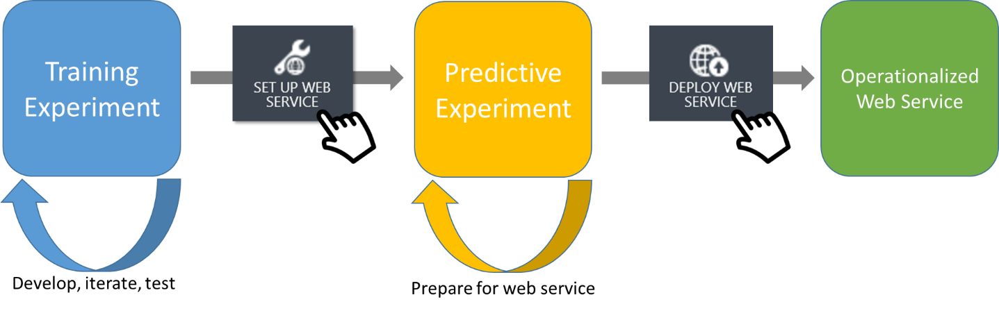

# David Markham
# Machine Learning & Statistics Project
# G.M.I.T.
# Lecturer: Dr. Ian Mcloughlin
# Topic: Create a Web Service That Makes Predictions

 

Sometimes Github won't open Jupyter Notebook files. If Github won't open your file, copy and paste the URL address from the Jupyter file on Github and paste in the following link. This will display it every time you wish to view it.

https://nbviewer.jupyter.org/ 

Create a web service that uses machine learning to make predictions based on the data set Power Production. The goal is to produce a model that accurately predicts wind turbine power output from wind speed values, as in the data set. You must then develop a web service that will respond with predicted power values based on speed values sent as HTTP requests.

### How to run it?

- Clone down this repository to your machine. 
- You will need an Anaconda environment to run it. 
- To see what packages you will need exactly, you can go to the requirements.txt file. 
- If you follow the steps above, this will hopefully help you run the application.
- Once you have all the steps done above, to run the application you can do the following. 

1. Run the powerServer.py file. 
2. Then copy the http address which will be displayed in your terminal and paste in your browser.
3. From here you run it, enter the wind speed, and an estimated power output will be displayed. 

### How to get started and run Jupyter Notebook.

Jupyter Notebook, and how to use one for this project.
For this project we will be using a Jupyter notebook to hold and display all our code. You will also need to download Anaconda, and the terminal which we will be using is going to be Commander.

• Create a new repository on Github, name it, initialize a ReadMe, Add.gitignore-Python, license, and click on clone/download and copy the link.

• Go to your command line, cd desktop, and type: git clone, space and right click. Creates a folder you just created on Github.

• CD into folder, type Jupyter Notebook, which is older but more reliable version, press enter, opens a browser, click on Notebook Python 3.

• Rename file.

• Type in some code in the cell, hold down shift and hit enter to display the code, and save! If you want to use markdown, click on the outer left part of the cell, escape and m, this will change the cell to markdown.

• Shut down browser, go to file, and press close & halt. (When you want to re-use or open up Jupyter again, re-start the kernel and run all cells, previous code might not work otherwise, which you had entered.)

• Go to command line, control plus c and release. Clears Python and and goes back to (master-origin).

• Git status (Tells you all the files updated)

• Git add . (pushes the work you done in the folder you are in up to Github)

• Git commit –m “Name of what you created or done”. (Labels the work you just did on the file.)

• Git push (Pushes all your work you just committed up to Github)

• Repository, ReadMe and Gitignore created.

